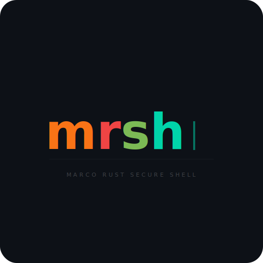

<p align="center">
  
</p>

<h1 align="center">rsh</h1>
<h3 align="center"><b>R</b>ust <b>S</b>ecure s<b>H</b>ell</h3>

<p align="center">
  A fast, modern alternative to SSH for remote machine management.<br>
  Single binary. TLS-encrypted. Delta-sync file transfers.
</p>

<p align="center">
  <a href="#features">Features</a> &middot;
  <a href="#quick-start">Quick Start</a> &middot;
  <a href="#usage">Usage</a> &middot;
  <a href="#building">Building</a> &middot;
  <a href="#security">Security</a>
</p>

---

## Why rsh?

SSH is great, but it wasn't designed for modern fleet management. **rsh** is built from the ground up in Rust for fast, secure remote operations:

- **Delta-sync transfers** &mdash; rsync-like CDC chunking, only changed blocks travel over the wire (up to 97% bandwidth savings)
- **Unified binary** &mdash; one `rsh` executable works as client, server, Windows service, and system tray app
- **SSH compatibility** &mdash; auto-detects SSH on the same port (peek first byte: `0x16`=TLS, `0x53`=SSH)
- **Persistent sessions** &mdash; ConPTY + ring buffer, detach and reattach from any client
- **NAT traversal** &mdash; built-in rendezvous relay for machines behind firewalls
- **GUI automation** &mdash; mouse, keyboard, window control over the wire
- **Remote GUI testing** &mdash; built for automated UI testing on remote machines (screenshot, click, type, verify)
- **AI-friendly** &mdash; designed for AI agent orchestration with built-in safety guards

## Features

| Category | Capabilities |
|----------|-------------|
| **Connection** | TLS 1.3, ed25519 auth, TOTP 2FA, SSH-style TOFU, multiplexed channels, ProxyJump (`-J`) |
| **File Transfer** | CDC delta-sync, block cache, hash cache, batch pipeline, `--checksum`, `--backup`, `--bwlimit`, `--progress` with ETA, relay push |
| **Shell** | Persistent ConPTY sessions, multi-client attach, tilde-escape commands, session recording (asciicast export) |
| **Execution** | Remote PowerShell exec, batch scripting (`.rsh` files), SOCKS5 proxy (`-D`), `--timeout` flag |
| **GUI** | Mouse control, keyboard input, window management, screen capture (MJPEG), multi-display, remote UI test automation |
| **System** | `reboot`, `shutdown`, `sleep`, `lock`, `wake` (WoL), `info`, `service` management, `ps`/`kill` |
| **Server** | Windows service (SCM), system tray with notifications, console mode, auto-tray launch (WTS), DLL plugins |
| **Fleet** | Multi-host commands, rendezvous relay, auto-discovery, self-update, fleet enrollment, `install-pack` (NSIS) |
| **Config** | SSH-style config file, Ratatui TUI editor, TUI host picker (fuzzy search), `--log-file` |
| **SSH** | Transparent SSH fallback, SFTP, agent forwarding (`-A`), local/reverse port forwarding (`-L`/`-R`) |

## Quick Start

### Client (Linux/macOS/Windows)

```bash
# Test connection (auto-tries ports 8822, 9822, 22)
rsh -h 192.168.1.100 ping

# Interactive shell
rsh -h 192.168.1.100 shell

# Execute command
rsh -h 192.168.1.100 exec "Get-Process"

# Push files (delta-sync)
rsh -h 192.168.1.100 push ./src C:\app\src

# Pull files
rsh -h 192.168.1.100 pull C:\logs\app.log ./local/
```

### Server (Windows)

```powershell
# Install as Windows service
.\rsh.exe --install
net start rsh

# Or run as tray icon
.\rsh.exe
```

## Usage

### File Transfer

```bash
# Delta-sync push (only changed blocks transfer)
rsh -h host push ./project C:\deploy\project

# With exclusions
rsh -h host -x '*.log' -x 'node_modules' push ./src C:\app\src

# Dry-run (see what would change)
rsh -h host --dry-run push ./data C:\backup

# With checksum verification
rsh -h host --checksum push ./data C:\backup

# Mirror mode (delete remote files not present locally)
rsh -h host --delete push ./src C:\app\src

# Bandwidth limit
rsh -h host --bwlimit 1024 push ./large-file.bin C:\data\
```

### Shell Sessions

```bash
# Start persistent session
rsh -h host shell

# Reattach to existing session
rsh -h host attach <session-id>

# List active sessions
rsh -h host sessions list

# Kill a session
rsh -h host sessions kill <session-id>

# Tilde-escape commands (inside session):
#   ~.  detach
#   ~u  upload file
#   ~d  download file
#   ~?  help
```

Sessions persist on the server. Detach with `~.` and reattach later from any client.

### Session Recording

```bash
# List recordings
rsh -h host recording list

# Export to asciicast format (for asciinema playback)
rsh -h host recording export <session-id> output.cast
```

### Remote Execution

```bash
rsh -h host exec "Get-Service | Where Status -eq Running"
rsh -h host ps                        # List processes
rsh -h host kill 1234                 # Kill process
rsh -h host ls C:\logs                # List directory
rsh -h host cat C:\logs\app.log       # Read file

# With timeout (kills command after N seconds)
rsh -h host --timeout 30 exec "long-running-command"
```

### System Control

```bash
rsh -h host reboot                    # Reboot remote machine
rsh -h host reboot -f                 # Force reboot (no graceful shutdown)
rsh -h host shutdown                  # Shutdown remote
rsh -h host sleep                     # Suspend/sleep remote
rsh -h host lock                      # Lock workstation
rsh -h host wake myserver             # Wake-on-LAN (uses MAC from config)
rsh -h host status                    # Connection quality + host info
rsh -h host info                      # Structured system info (JSON)
```

### Service Management

```bash
rsh -h host service list              # List all services
rsh -h host service status <name>     # Service status
rsh -h host service start <name>      # Start service
rsh -h host service stop <name>       # Stop service
rsh -h host service restart <name>    # Restart service
```

### GUI Automation

```bash
# Mouse
rsh -h host mouse move 500 300
rsh -h host mouse click
rsh -h host mouse click right

# Keyboard
rsh -h host key type "Hello World"
rsh -h host key tap enter
rsh -h host key combo ctrl shift esc

# Windows
rsh -h host window list
rsh -h host window find "Notepad"
rsh -h host window activate "Chrome"
```

### Batch Scripting

```bash
rsh -h host -f commands.rsh
```

```bash
# commands.rsh
exec "Get-Date"
mouse move 500 300
mouse click
key type "automated input"
sleep 2000
exec "hostname"
echo "Done on: $_"
```

### Connection Multiplexing

```bash
# Start a control master (reuse connection for subsequent commands)
rsh -h host -M exec "hostname"

# Subsequent commands reuse the existing connection (automatic)
rsh -h host exec "Get-Date"

# Skip control socket for this command
rsh -h host --no-mux exec "isolated-command"

# Stop control master
rsh -h host --mux-stop
```

### ProxyJump

```bash
# Connect through a jump host
rsh -h target -J jumphost exec "hostname"

# Jump host with custom port
rsh -h target -J jumphost:9822 exec "hostname"
```

### Fleet Management

```bash
# Execute on multiple hosts
rsh fleet exec "hostname" --hosts host1,host2,host3

# Update all hosts
rsh fleet update --hosts host1,host2,host3

# Create installer package with pre-configured connection
rsh install-pack --server 192.168.1.100 --key ~/.ssh/id_ed25519.pub -o installer.exe
```

### SSH Compatibility

```bash
# Auto-detect: tries rsh, falls back to SSH
rsh -h host ping

# Force SSH
rsh -h host --ssh exec "uname -a"

# SSH tunneling
rsh -h host tunnel -L 8080:localhost:80

# Reverse port forwarding
rsh -h host tunnel -R 9090:localhost:80

# SOCKS5 proxy
rsh -h host tunnel -D 1080

# SSH agent forwarding
rsh -h host -A shell
```

### NAT Traversal (Rendezvous)

```bash
# Connect via device ID (through relay)
rsh -h 118855822 ping

# P2P and relay race in parallel — fastest wins
```

Configure in `~/.rsh/config`:

```
RendezvousServer rdv.example.com:21116

Host myserver
    DeviceID 118855822
    Port 8822
```

### Self-hosted Relay

```bash
# Run your own rendezvous server (hbbs-compatible)
rsh rendezvous --port 21116

# Run your own relay server (hbbr-compatible)
rsh relay --port 21117
```

### File Watching

```bash
# Watch local directory and auto-push changes to remote
rsh -h host watch ./src C:\app\src

# Useful for live development — changes sync automatically
```

### Screen Capture

```bash
rsh -h host screen stream     # MJPEG live stream
rsh -h host screen capture    # Single screenshot
```

## Configuration

SSH-style config file at `~/.rsh/config`:

```
# Global defaults
RendezvousServer rdv.example.com:21116

# Per-host settings
Host myserver
    Hostname 192.168.1.100
    Port 8822                 # Explicit port (skips auto-try)
    MAC aa:bb:cc:dd:ee:ff    # For Wake-on-LAN
    DeviceID 118855822        # For relay connections
```

**Port resolution order**: (1) explicit `-p` flag, (2) config `Port` field, (3) auto-try 8822 → 9822 → 22 with 3s timeout per port.

### Server Configuration

Server files live in `C:\ProgramData\remote-shell\`:

```
C:\ProgramData\remote-shell\
├── rsh.exe              # Binary (service + tray + client)
├── authorized_keys      # Ed25519 public keys (auto-reloaded)
├── server_key           # Auto-generated on first run
├── startup.bat          # Optional: runs at service start
├── plugins\             # Plugin DLLs
├── cache\               # Block cache (msgpack KV)
└── rsh.log              # Server log
```

## Building

Requires Rust 1.85+ (edition 2024) and `x86_64-pc-windows-gnu` target for cross-compilation.

```bash
# Linux client
cargo build --release

# Windows client+server (cross-compile from Linux)
cargo build --release --target x86_64-pc-windows-gnu

# Run tests (539 tests on Linux, ~12s)
cargo test --workspace
```

Binaries are placed in `target/release/rsh` (~5.5 MB) and `target/x86_64-pc-windows-gnu/release/rsh.exe` (~4.8 MB). Both are stripped with LTO enabled.

## Security

- **TLS 1.3** for all connections (self-signed certs with TOFU pinning)
- **Ed25519** challenge-response authentication (same key format as SSH)
- **TOTP 2FA** &mdash; optional per-key two-factor authentication
- **No passwords** &mdash; key-based auth only (ed25519)
- **Known hosts** &mdash; server certificate fingerprints are verified on first connect and pinned
- **Authorized keys** &mdash; hot-reloaded on every connection, no restart needed
- **Rate limiting** &mdash; IPs banned after 5 failed auth attempts within 60 seconds

### Generating Keys

rsh has a built-in key generator (no OpenSSH required):

```bash
# Generate ed25519 key pair (default: ~/.rsh/id_ed25519 + .pub)
rsh keygen

# Generate to custom path
rsh keygen /path/to/mykey

# Copy public key to server
rsh -h host push ~/.rsh/id_ed25519.pub C:\ProgramData\remote-shell\authorized_keys
```

Standard SSH ed25519 keys (`ssh-keygen -t ed25519`) also work — rsh uses the same OpenSSH format.

## Architecture

```
rsh (workspace root)
├── src/main.rs              # CLI entry point
└── crates/
    ├── rsh-core/            # Protocol, TLS, auth, config
    ├── rsh-client/          # Client commands, shell, SFTP, tunneling
    ├── rsh-server/          # Server: dispatch, exec, service, tray, GUI
    ├── rsh-transfer/        # CDC chunking, delta-sync, block cache
    └── rsh-relay/           # Rendezvous server + relay protocol
```

### Wire Protocol

- **Command port** (default 8822, auto-tries 8822 → 9822 → 22 when `-p` omitted): Length-prefixed binary framing (4-byte BE header) over TLS
- **Stream port** (command port + 1): JSON + raw streams for push/pull
- **SSH detection**: First byte peek &mdash; `0x16` routes to TLS, `0x53` routes to SSH handler
- **Multiplexing**: Multiple logical channels over single TLS connection

## Plugin System

Extend rsh with custom DLL plugins:

```c
#include "rsh_plugin.h"

RSH_API int RSH_GetPluginInfo(char* buf, uint32_t* len) {
    const char* info = "{\"name\":\"myplugin\",\"version\":\"1.0\",\"commands\":[\"hello\"]}";
    strcpy(buf, info); *len = strlen(info);
    return 0;
}

RSH_API int RSH_Execute(const char* req, uint32_t reqLen, char* resp, uint32_t* respLen) {
    snprintf(resp, *respLen, "{\"success\":true,\"output\":\"Hello from plugin!\"}");
    *respLen = strlen(resp);
    return 0;
}
```

See `plugins/` for the full header and example.

## AI Agent Integration

rsh is designed to be used by AI agents (Claude Code, similar tools) for autonomous remote machine management. Several features make it particularly suited for AI orchestration:

**Structured output**: All commands return JSON responses with `success`, `output`, and `error` fields — easy to parse programmatically without screen-scraping.

**Native commands**: Built-in `ps`, `ls`, `cat`, `screenshot`, `mouse`, `key`, `window` commands eliminate the need to construct shell one-liners for common operations.

**Batch scripting**: `.rsh` script files allow multi-step automation sequences.

### Safety Guards

The server includes built-in protection against self-destructive commands — a critical safety net when AI agents manage remote machines. The exec handler blocks commands that would kill or stop the rsh process serving the current connection:

| Blocked Pattern | Why |
|----------------|-----|
| `taskkill /im rsh.exe` | Would kill the process serving this connection |
| `Stop-Service rsh` / `net stop rsh` | Would stop the service, cutting off access |
| `Stop-Process -Name rsh` | PowerShell equivalent of taskkill |
| `Remove-Item ... rsh.exe` | Deleting the binary prevents service restart |
| `sc delete rsh` | Removing service registration prevents restart |

Blocked commands return an error with the reason and suggested safe alternative (e.g., `rsh self-update`). This prevents the most common AI agent lockout scenario without restricting legitimate operations.

### Anti-Abuse Measures

rsh includes several measures to prevent misuse as a covert remote access tool:

| Measure | Description |
|---------|-------------|
| **Mandatory tray icon** | Service installation (`--install`) registers a logon task that launches the tray companion at every user login. Users always see a system tray icon indicating rsh is active. |
| **Connection toast notifications** | When a client authenticates, the tray icon displays a Windows balloon notification showing the client IP and key comment. Every remote connection has user-visible evidence. |
| **Failed auth rate limiting** | IPs that fail authentication 5 times within 60 seconds are banned for 5 minutes. Prevents brute-force key guessing. |
| **Exec safety guards** | Server blocks commands that would kill/stop/delete the rsh process (see table above). Prevents both accidental and deliberate self-destruction. |

These measures ensure that a legitimate administrator always has visibility into rsh activity, while making it impractical for casual attackers to abuse an installed rsh instance without detection.

## Relay Protocol Compatibility

The rendezvous and relay protocol in `rsh-relay` is a **clean-room MIT rewrite** that is **wire-compatible with RustDesk** hbbs/hbbr servers. This means:

- If you already run your own RustDesk relay infrastructure, **rsh can use it as-is** — no need to deploy new relay servers
- The same rendezvous server (hbbs) and relay server (hbbr) handle both RustDesk and rsh clients
- Protocol extensions (health checks, metrics) use high field numbers that are silently ignored by standard RustDesk servers

The implementation is written from scratch with no derived code, using the same publicly documented wire format (protobuf message types and BytesCodec framing).

## Acknowledgments

rsh stands on the shoulders of these projects and ideas:

| Project | What we drew from |
|---------|-------------------|
| [OpenSSH](https://www.openssh.com/) | Ed25519 key format, authorized_keys convention, `~.` escape sequences, config file syntax, SSH protocol detection for interop |
| [RustDesk](https://github.com/rustdesk/rustdesk) | Rendezvous/relay wire protocol (protobuf over BytesCodec). rsh-relay is a clean-room MIT rewrite that is wire-compatible with RustDesk hbbs/hbbr servers |
| [rsync](https://rsync.samba.org/) | Inspiration for delta-sync file transfers. rsh uses Rabin-polynomial CDC (content-defined chunking) with block-level dedup and SHA-256 verification |
| [mosh](https://mosh.org/) | The idea that SSH can be reimagined for modern use — roaming, resilience, and state synchronization |
| [ConPTY](https://devblogs.microsoft.com/commandline/windows-command-line-introducing-the-windows-pseudo-console-conpty/) | Microsoft's pseudo-console API that makes proper Windows terminal emulation possible for persistent shell sessions |
| [RFC 1928](https://www.rfc-editor.org/rfc/rfc1928) | SOCKS5 protocol for the built-in proxy (`rsh tunnel -D`) |

## Known Limitations

- **GUI automation is Windows-only** — ConPTY shell, service SCM, tray icon, mouse/keyboard/window control require Windows. Server daemon mode (exec, file transfer, relay) works on all platforms
- **QUIC transport** — server + client behind `--features quic`; supports `ping` and `exec` over QUIC (`rsh --quic -h host exec 'cmd'`)

## License

MIT — see [LICENSE](LICENSE).

## Contributing

Contributions welcome. Please open an issue first to discuss what you'd like to change.
